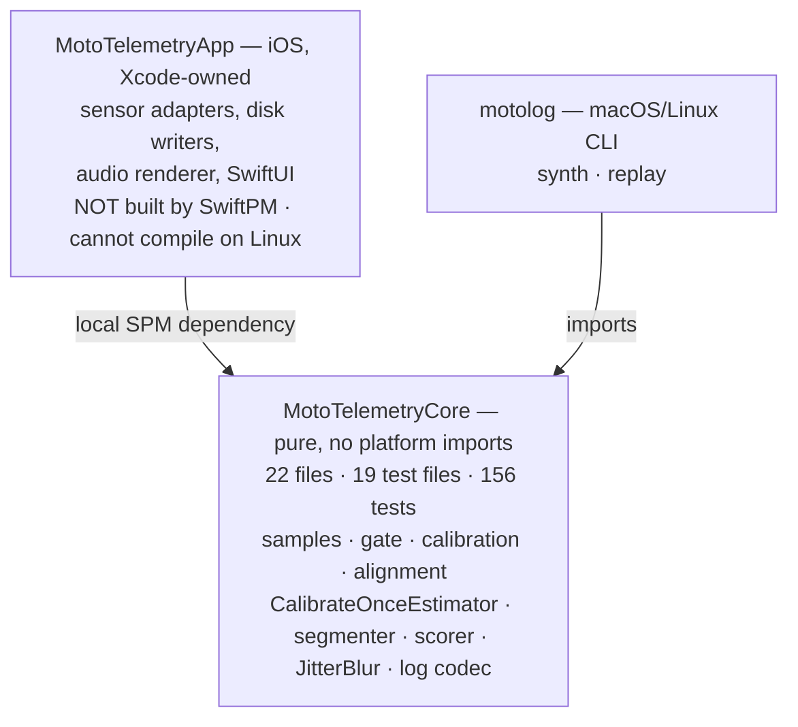
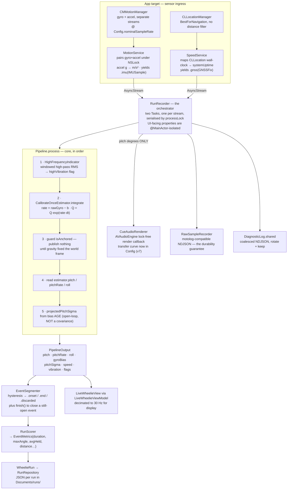
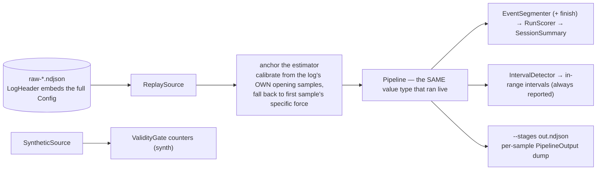

# Architecture — as built

Verified against the code on `beta/calibrate-once`, 2026-09-04, by reading the source.
This is the **as-built** picture, not the intent. Where it disagrees with
`.kiro/specs/*/design.md`, the disagreement is listed in §6 and the code is the
authority.

`MotoTelemetryCore` is **22 Swift files with 19 test files (156 test methods)**. The
iOS app target (`MotoTelemetryApp`, ~40 files) is being trimmed of dead code on this
branch, so its file count is deliberately described by structure rather than a number —
an exact count is exactly what went stale last time. `motolog` is 1 file.

---

## 1. The whole product in one sentence

Sensors produce a tagged sample stream, one estimator turns that stream into a pitch
angle, and the angle turns into a sound, a gauge, a score, and a log. Everything else in
the repo either feeds that line or drains it.

The layering rule is the only structural invariant worth defending: **all logic lives in
`MotoTelemetryCore`, which has zero platform imports and is fully testable on Linux.**
The iOS target is a shell that moves bytes in and pixels/audio out. If logic appears in
the app target, that is a defect by construction.



---

## 2. The live path

One `Sample` at a time. `Pipeline` is a **value type** with a per-sample step function,
which is what makes replay and live literally the same code:

```swift
public mutating func process(_ sample: Sample) -> PipelineOutput?   // Pipeline.swift
```

Only `.imu` produces output. `.gnss` mutates internal state (speed only) and returns
`nil`; `.baro` and `.wheelSpeed` are accepted, kept in the wire format for old logs, and
ignored.

### The estimator: `CalibrateOnceEstimator`, not a gated ESKF

**The gated ESKF is gone.** `AttitudeESKF`, the RTS smoother `AttitudeSmoother`,
`DelayedStateBuffer`, `GradeBaseline`, `AlignmentSolver`, the `CueEngine` and
`LinearAlgebra.swift` were all **deleted** on this branch — not disabled behind a flag.
They were correct and tested and never ran in the product, which is this project's
signature failure mode. Git holds them on `main` and `staging/core-pipeline`.

What runs now is the whole live estimator, stated in three lines:

```
rate  = rawGyro - b            // b: gyro bias, measured ONCE at calibration, held constant
Q     = Q * exp(rate * dt)     // integrate raw gyro as a quaternion
pitch = asin(rotate(forwardInBody).z)   // axis elevation
```

**The accelerometer never feeds the live estimate.** It is a calibration-only
instrument: it supplies the gravity anchor that fixes the world frame and drives rest
detection during a calibration session, and it is still recorded to disk in the raw log.
It is not consumed by the pipeline. This is deliberate — see the estimator's own doc
comment and §"Why the accelerometer is excluded" below.

Three consequences follow directly, each visible rather than silent:
- **No grade correction.** `GradeBaseline` estimated road grade from gate-open pitch;
  with it gone, riding uphill reads as nose-up.
- **No drift correction.** Bias is measured once, so thermal walk accumulates
  (~0.1 deg/s over 30 min ≈ ~5 deg over a 10 s hold at 0.5 deg/s). `pitchSigma` grows
  with bias *age* so the UI can say how much to distrust the number.
- **No GNSS/IMU fusion.** Speed is an independent ~1 Hz display channel.



### Post-run smoothing: `JitterBlur`, not RTS

The "second, better number after the ride" is a **zero-phase display/scoring blur**
(`JitterBlur`, odd-width centred window, `Config.blurWindowSamples`), **not** an RTS
smoother. It removes sample-to-sample jitter; it does **not** correct drift, and it is
not a re-estimation of attitude. Events shorter than `blurMinSamples` are stored raw with
`QualityFlags.smoothingUnavailable` rather than blurred with a window wider than the data.

### Why the accelerometer is excluded, not merely down-weighted

An accelerometer measures specific force — gravity **plus** linear acceleration — and
cannot decompose them. A sustained wheelie needs thrust of roughly `g·tan(θ)`, so the
accelerometer's error is *correlated with the very signal being measured*: at 0.5 g of
forward acceleration it reports 26.6 deg of pitch that is not there. Weighting it low does
not help, because variance inflation models **uncorrelated** error — the filter would
treat repeated biased samples as independent evidence and still converge on the wrong
answer. That is why the live path does not consume the accelerometer at all outside
calibration. Apple's fused fields are excluded for the same reason at one remove:
`rotationRate` is debiased using the accelerometer and `attitude`/`gravity` derive from
it, so all three re-import the confound. Raw gyro carries no accelerometer correction.

### Where the validity gate is still used

`ValidityGate` answers "is the bike at rest right now". On this branch its live consumer
is **calibration**: `BiasEstimator` builds its own gate from the **wide** calibration
band (`calibrationSpecificForceLow/High`, ±0.10 g) and `calibrationMaxRotationRate`
(5 deg/s), because there the band is only an accelerometer proxy for stillness and never
enters the gyro mean. The estimator's own tight band (`gateSpecificForceLow/High`,
±0.03 g) and `gateMaxRotationRate` (3 deg/s) remain in `Config` and stay tight: the
reason they may **never** be widened globally is unchanged — 0.3 g of thrust gives
|f| = 1.044 g, inside a ±0.10 g band, and admitting it as "rest" reintroduces the
atan(0.3) = 16.7 deg phantom angle this project exists to prevent. The per-consumer split
is the mechanism that keeps calibration achievable on a running bike without loosening the
accuracy guard. (In the deleted ESKF this same verdict had five consumers; with the ESKF,
smoother, delayed-state buffer and grade baseline gone, calibration is the one that
survives.)

---

## 3. Calibration — two orthogonal concerns

| | `Calibration.swift` | `MountAlignment.swift` |
|---|---|---|
| Answers | what is the gyro's zero | which way is the bike pointing |
| Produces | `BiasEstimate{bias, sigma, sampleCount, measuredGravity, …}` | `MountAlignment{forwardInBody, upInBody, leftInBody, swipeConfidence, …}` |
| Method | Welford mean over ~2 s of gate-open quiet (`biasCalibrationDuration` = 2.0 s) | **one** swipe along the chassis + horizontal-projection math |
| Persisted by | `CalibrationService` (app), keyed by `bikeProfileID` | same |

They share only a `bikeProfileID` and a gate. `CalibrationTracker` separately decays
confidence with age and thermal state, yielding `.calibrated` / `.stale` / `.failed`.

### Mount alignment is one gesture, not two

The old two-gesture rest-plus-pull closed-form solve (`AlignmentSolver`) is **deleted**.
The beta captures alignment from **one** swipe (`MountAlignment.fromSwipe` /
`fromMeasuredGravity(specificForce:screenYaw:)`):

- Gravity fixes `up` exactly and leaves one degree of freedom (rotation about up); the
  swipe supplies it. `p = swipe − (swipe·ĝ)ĝ`; `forward = p / |p|`.
- **`|p|` is a free degeneracy/confidence metric**, equal to `sin(angle between swipe and
  gravity)`, surfaced as `swipeConfidence`. It is a **classifier**, not a quality score:
  - `|p|` near 1 — flat-ish mount, the drawn line *is* the chassis direction. Use it.
  - `|p| < alignmentConfidenceMin` (0.35, ≈ 20 deg) — vertical mount, the swipe ran along
    gravity, so heading comes from the **screen normal** (`fromScreenNormal`,
    device −Z into the screen). This is the explicit branch that also avoids the `0/0`
    NaN at `|p| = 0`.
- `fromSwipe` does the UIKit/SwiftUI dy-grows-downward flip internally, so a
  bottom-to-top swipe is not silently read as a stoppie.

`fromMeasuredGravity(specificForce:)` (gravity only, assumes device −X is lateral) still
exists as the assumption-of-last-resort path.

**Re-anchor** (`Pipeline.requestReanchor()` → `CalibrateOnceEstimator.anchor(with:)`)
makes the pose the rider just held the new zero: it rebuilds attitude from the measured
specific force and clears `lastTime` so no stale `dt` integrates onto the freshly-declared
zero. The alignment side of a re-level uses `MountAlignment.releveled(againstMeasuredGravity:)`
— it keeps the forward heading and Gram-Schmidts it against the new `up`, deliberately
**not** re-running `fromMeasuredGravity`, which would re-guess which axis is forward.
Without the re-level a 35 deg pose still reads 35 deg after the re-zero.

---

## 4. The offline path



`Config` is embedded in every log header and decoded tolerantly, field by field, with
current defaults as fallback — so a v1 log still replays under today's **v7**. This is
what makes `motolog replay` a real regression tool rather than an approximation.

`motolog` exposes exactly **two** subcommands:

- **`synth`** — in-memory synthetic source through the gate, counters only.
- **`replay <log.ndjson>`** with `--config <file>`, `--stages <out.ndjson>`, `--json`.
  There is **no `--cues` flag** (and no cue engine to drive one); passing any unknown
  option exits 1. Intervals are always reported; there is no `--intervals` flag.

### Two replay bugs the parent fixed, documented because this section covers them

- **`replay` produced zero output because it never anchored the estimator.**
  `CalibrateOnceEstimator` publishes nothing until a gravity vector fixes the world frame
  (`Pipeline.processIMU` guards on `isAnchored`), and `gravityAnchor:` is a *defaulted*
  parameter, so a pipeline built without one compiled clean and returned `nil` for every
  sample — the tool printed "pipeline samples: 0" on a perfectly good log. `replay` now
  runs a `BiasEstimator` over the log's opening samples and anchors from the measured
  gravity, falling back to the first IMU sample's specific force (stated in the output,
  not hidden) when there is no clean at-rest window. An empty pipeline is now treated as a
  **failure** (exit 2), not a finding.
- **`EventSegmenter` dropped an event still open when the stream ended.** It now has
  `finish()`, which callers **must** invoke after the last sample; `replay` calls it. A
  log that ended mid-wheelie previously lost the event entirely, and the longest holds are
  the most likely to be truncated — so the loss was biased toward the best runs.

---

## 5. What is built but NOT connected

Smaller than it used to be — several orphans in the old inventory were deleted rather than
wired, and two were actually connected.

| Thing | State | Consequence |
|---|---|---|
| **`AttitudeSmoother` / `AttitudeESKF` / `DelayedStateBuffer` / `GradeBaseline` / `AlignmentSolver` / `CueEngine`** | **DELETED** on this branch (were orphaned; now gone). | No longer part of the repo. Live on `main` / `staging/core-pipeline` if ever needed. |
| **`SessionWriter` / `SessionRecovery` / `VibrationRecorder` / `Features/Session/` views** | **Removed** as dead code on this branch. | The durability guarantee now belongs to **`RawSampleRecorder`**, which writes motolog-compatible NDJSON on the live path. Vibration characterisation is not collected. |
| **`IntervalDetector` in the app** | **NOW CONNECTED.** `WheelieRun.angleIntervals` / `speedIntervals` run a real `IntervalDetector` (previously `compactMap { _ in nil }` → permanent `[]`). | RunDetails' "ANGLE IN RANGE" and `RangeIntervalTimeline` render real intervals. |
| **`BikeProfileStore`** | Persists, but the live path still tends to use a throwaway `UUID()` / a default mount rather than a fully round-tripped per-bike profile. | Per-bike calibration does not reliably round-trip; verify before relying on it. |
| **`Sample.baro` / `Sample.wheelSpeed`** | Logged / reserved, no consumer. No barometer source in the app. `Config.baroDynamicPressureK` is inert (grade is not corrected at all in this build). | Forward compatibility / wire-format stability, not features. |
| `Downsample`, `RelativeMetricColorScale`, `QualityMonitor` | Alive but off the live estimator path — display / bench analysis. | Correct as-is; noted so nobody hunts for them in the pipeline. |

### Live-path concurrency: fixed

The old defect — `RunRecorder` mutating `@Observable` UI state from the two sensor
`Task`s with no hop to the main actor — is **fixed**. Every UI-facing property on
`RunRecorder` is now `@MainActor`-isolated while sample processing runs on the detached
sensor tasks serialised by `processLock`.

---

## 6. Where `design.md` is now stale

| `design.md` says | Code says |
|---|---|
| ESKF / RTS smoother / delayed-state GNSS / grade baseline are core capabilities | All **deleted** on this branch; the live estimator is `CalibrateOnceEstimator` (raw gyro debiased once) |
| Two-gesture closed-form mount solve (`AlignmentSolver`) | One-gesture swipe with horizontal projection + a screen-normal branch for vertical mounts |
| CLI box lists more than two subcommands / a `--cues` flag | Only `synth` and `replay`; no `--cues` |
| `Config` version → an earlier number | `Config.version = 7` (v7 named `maxIntegrationDt` and `maxSampleGap` and moved the cue transfer curve into `Config`) |
| Bias calibration is 8 s | `biasCalibrationDuration = 2.0` s |

The spec is intent; this document is what exists. Where the code is thinner than the
spec (no grade, no drift correction, no fusion), that is a deliberate beta simplification,
stated in §2, not an omission to be reconciled.
