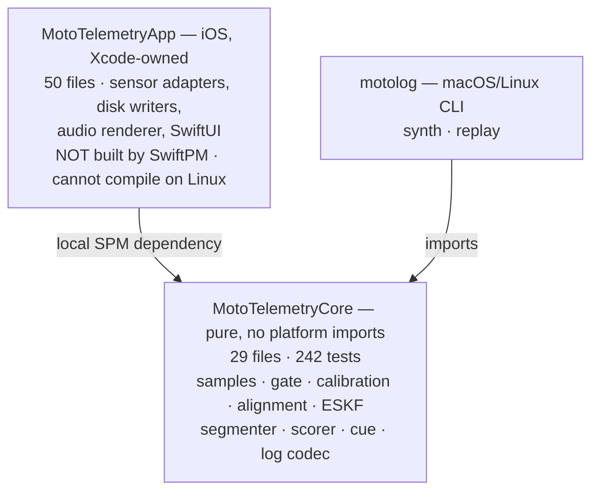
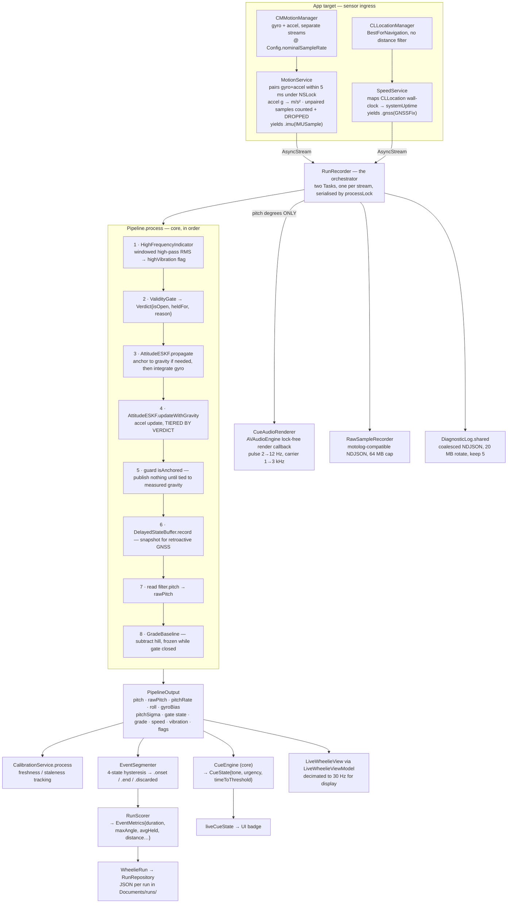
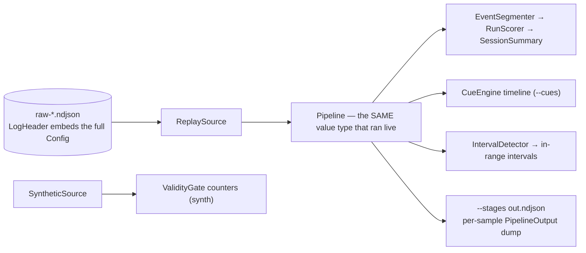

# Architecture — as built

Verified against the code on `fix/device-log-audit-bugs`, 2026-08-28, by reading all 80
Swift files. This is the **as-built** picture, not the intent. Where it disagrees with
`.kiro/specs/build-the-spec-for-a/design.md`, the disagreement is listed in §6 and the
code is the authority.

80 Swift files: 29 in `MotoTelemetryCore`, 50 in `MotoTelemetryApp`, 1 in `motolog`.

---

## 1. The whole product in one sentence

Sensors produce a tagged sample stream, one filter turns that stream into a pitch angle,
and the angle turns into a sound, a gauge, a score, and a log. Everything else in the
repo either feeds that line or drains it.

The layering rule is the only structural invariant worth defending: **all logic lives in
`MotoTelemetryCore`, which has zero platform imports and is fully testable on Linux.**
The iOS target is a shell that moves bytes in and pixels/audio out. If logic appears in
the app target, that is a defect by construction.



---

## 2. The live path

One `Sample` at a time. `Pipeline` is a **value type** with a per-sample step function,
which is what makes replay and live literally the same code:

```swift
public mutating func process(_ sample: Sample) -> PipelineOutput?   // Pipeline.swift:143
```

Only `.imu` produces output. `.gnss` mutates internal state and returns `nil`; `.baro`
and `.wheelSpeed` are accepted, logged, and ignored in v1.



### The GNSS side path

A GNSS fix arrives late — its `fixTime` is older than the filter's current time. Rather
than applying it at the wrong instant, `DelayedStateBuffer.applyRetroactively` rewinds
the filter to the fix's own timestamp, calls `AttitudeESKF.updateWithGNSSPitch`, then
re-propagates forward, reconstructing each step's verdict from the stored snapshots.

### Why the gate's verdict has five consumers, not one

`ValidityGate` answers "is the bike at rest right now". That single verdict gates:

1. **`BiasEstimator`** — gyro-bias accumulation, on the **wide** band (`calibrationSpecificForceLow/High`, ±0.10 g)
2. **`AttitudeESKF.updateWithGravity`** — the accelerometer update, on the **narrow** band (±0.03 g)
3. **`AttitudeESKF.propagate`** — the initial anchor decision, plus `anchorLevelCosine`
4. **`AlignmentSolver.addRestSample`** — mount-geometry solve
5. **`DelayedStateBuffer.applyRetroactively`** — verdict replay during re-propagation

This is why the band is split per consumer. Widening it globally to help calibration also
tells the filter that 0.3 g of thrust (|f| = 1.044 g) is rest, and it converges on
atan(0.3) = 16.7° of phantom wheelie — the exact failure this project exists to prevent.
**Any future threshold change must trace all five call sites.**

---

## 3. Calibration — two orthogonal concerns

| | `Calibration.swift` | `MountAlignment.swift` |
|---|---|---|
| Answers | what is the gyro's zero | which way is the bike pointing |
| Produces | `BiasEstimate{bias, sigma, sampleCount, …}` | `MountAlignment{forwardInBody, upInBody, …}` |
| Method | Welford mean over ~8 s of gate-open quiet | two-gesture closed-form solve (rest → down, hard pull → forward) |
| Persisted by | `CalibrationService` (app), keyed by `bikeProfileID` | same |

They share only a `bikeProfileID` and a gate. `CalibrationTracker` separately decays
confidence with age and thermal state, yielding `.calibrated` / `.stale` / `.failed`.

**Re-anchor** (`requestReanchor()`) clears `hasAnchored` and waives the near-level check,
because the rider has declared the pose level. On the next gate-open sample the filter
re-derives attitude from measured gravity *and* re-levels the alignment via
`MountAlignment.releveled(againstMeasuredGravity:)` — keeping the forward heading,
replacing `up`, re-orthogonalising. It deliberately does **not** re-run
`fromMeasuredGravity`, which would re-guess which axis is forward. Without the re-level,
a 35° pose still reads 35° after the re-zero, because pitch is the elevation of
`forwardInBody` and a stale forward is not perpendicular to the new `up`.

---

## 4. The offline path



`Config` is embedded in every log header and decoded tolerantly, field by field, with
current defaults as fallback — so a v1 log still replays under today's v4. This is what
makes `motolog replay` a real regression tool rather than an approximation.

`motolog` exposes exactly two subcommands: **`synth`** (in-memory synthetic source
through the gate, counters only) and **`replay <log.ndjson>`** with `--config`,
`--stages`, `--cues`, `--json`.

---

## 5. What is built but NOT connected

This is the part that makes the repo feel larger than it is. Each item below is complete,
often tested, and reachable from nothing.

| Thing | State | Consequence |
|---|---|---|
| **`AttitudeSmoother`** (RTS post-ride smoother) | No caller in `Sources/` at all — only its own tests. Not in `Pipeline`, not in the app, not in `motolog`. | The whole "second, better number after the ride" capability does not run. `Config.smootherWindowMargin` / `smootherMinAnchorSamples` and the `.smoothingUnavailable` flag are wired to nothing. |
| **`IntervalDetector`** in the app | Runs only in `motolog`. `WheelieRun.angleIntervals` / `speedIntervals` are `compactMap { _ in nil }` — always `[]`. | RunDetails shows "ANGLE IN RANGE 0.0s" permanently, and `RangeIntervalTimeline` renders an empty timeline. |
| **`SessionWriter`** (actor; NDJSON + manifest, SPSC ring, fsync) | Zero callers. | Redundant: `RawSampleRecorder` already writes motolog-compatible NDJSON on the live path. Delete rather than wire. |
| **`SessionRecovery`** | Zero callers; repairs `SessionWriter`'s layout, which nothing writes. | Dead by dependency. |
| **`VibrationRecorder`** (`.caf` rev-sweep capture) | Zero callers. | Vibration characterisation is not collected. |
| **`Features/Session/`** — `RecordingModeView`, `RecordingControlsView`, `SyncFlashView`, `ExportShareView` | All four unreachable; `RootTabView` has exactly two tabs. | 4 files of UI nobody can open. |
| **`BikeProfileStore`** | Exists and persists, but `RunRecorder` / `LiveWheelieViewModel` use a throwaway `UUID()` and a hardcoded `.portraitMount`. | Per-bike calibration does not actually round-trip; every session is a new "bike". |
| **`Sample.baro` / `Sample.wheelSpeed`** | Logged / reserved, no consumer. No barometer source exists in the app at all. | Fine as forward compatibility; just not features. |
| `AllanDeviation`, `TelemetryExport`, `Downsample`, `RelativeMetricColorScale` | Alive but off the live path — bench analysis and display only. | Correct as-is; noted so nobody hunts for them in the pipeline. |

### Known live-path defect still open

`RunRecorder` mutates its `@Observable` published properties (`livePitch`, `eventActive`,
`sampleCount`, …) from the two sensor `Task`s. `processLock` serialises those two tasks
against each other, but there is **no hop to the main actor**, so UI-observed state is
still written off-main at sample rate.

---

## 6. Where `design.md` is now stale

| `design.md` says | Code says |
|---|---|
| §1 lists "ESKF · RTS smoother" as peer core capabilities | The smoother is unreachable from every entry point (§5) |
| §1 CLI box: "replay · synth · fft · allan · verify" | Only `synth` and `replay` exist |
| §3.1 `Config` "version → 2" | `Config.version = 4` |
| §3.2 clean single-owner service graph | Was constructing `ServiceGraph` 3× via a `@State` autoclosure trap; fixed on this branch |

`tasks.md`: 26 `[x]` done, 39 `[~]` staged, 31 `[ ]` open, 96 total. The `[~]` count is
what makes the project look unfinished — much of it is written and unverified rather than
unwritten. Note that M4 (the smoother) is recorded as complete on the strength of its
tests while having no caller, which is the same "files exist ≠ feature works" trap the
app target already taught us.
